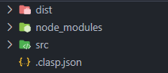
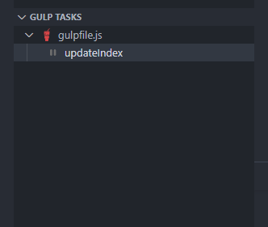

# University Tracker 2.00

Paperwork is an integral part for any company and that's where this system comes in to facilitate the means to make administration easier by linking everything on the cloud. Built for Online Education Institutes, Live Broadcasting and Production Companies. Designed to entice people with instant updates, schedules & statistics within the company they work for. My UX/UI approach was to communicate as much as possible by doing as little as possible. It’s an internal workplace system for logging administrative work within a workforce: A [FORD assembly line](https://corporate.ford.com/articles/history/moving-assembly-line.html#:~:text=Henry%20Ford%20famously%20remarked%20that,built%20step%2Dby%2Dstep.) for logging data and storing files accordingly. I use google sheets as a front-end application and host to show statistics: It's like Excel but with servers making https requests.

## Project Links

[Index](https://tertiusroach.github.io/university-tracker_2.00/dist/index.html)

[Academics](https://tertiusroach.github.io/university-tracker_2.00/dist/akademici.html)
[Broadcasts](https://tertiusroach.github.io/university-tracker_2.00/dist/uitsendings.html)
[Operational](https://tertiusroach.github.io/university-tracker_2.00/dist/operasioneel.html)
[Administration](https://tertiusroach.github.io/university-tracker_2.00/dist/administrasie.html)

## Install NPM Commands for Node.js

---

    npm init -y

---

    npm install gulp
    npm install sass
    npm install jquery
    npm install typescript

---

    npm install --save-dev gulp
    npm install --save-dev gulp-sass
    npm install --save-dev gulp-clean
    npm install --save-dev gulp-concat
    npm install --save-dev gulp-uglify
    npm install --save-dev gulp-rename
    npm install --save-dev gulp-htmlmin
    npm install --save-dev gulp-uglifycss
    npm install --save-dev gulp-typescript
    npm install --save-dev gulp-sourcemaps
    npm install --save-dev gulp-delete-file
    npm install --save-dev gulp-string-replace
    npm install --save-dev gulp-strip-css-comments
    npm install --save-dev gulp-remove-html-comments

---

    npm install --save-dev @types/jquery

---

## Clasp (Setup)

This [video tutorial](https://www.youtube.com/watch?v=4Qlt3p6N0es&t=437s&ab_channel=LearnGoogleSheets%26ExcelSpreadsheets) for [Clasp](https://github.com/google/clasp) helped me setup [Google Sheets](https://www.google.com/sheets/about/) for the workflow. To link [Apps Script](https://developers.google.com/apps-script/reference/spreadsheet) with [Visual Studio Code](https://code.visualstudio.com/). Remember to enable your [Google Apps Script API](https://script.google.com/home/usersettings) to give Visual Studio Code permission to change the code associated with [Apps Script](https://developers.google.com/apps-script/reference/spreadsheet) coding interface. Install Google clasp using [Node.js](https://nodejs.org/en/) onto your computer before using [Node Package Manager](https://www.npmjs.com/) commands inside your [terminal](src/images/png/screenshots/terminal-screenshot.png).

    npm install --save-dev @google/clasp

Confirm if the clasp CLI is installed with this terminal command.

    clasp -v

Log into your Google account by typing 'clasp login' into the terminal and press enter. This will open a browser for you to log into your account.

    clasp login

Get the [Apps Script ID](src/images/png/screenshots/google-sheets-id.png) you want to link to [Visual Studio Code](https://code.visualstudio.com/). There should also be a specification of the folder location for the JavaScript files. My folder storage location is "[src/apps/clasp/](src/images/png/screenshots/clasp-folder-location.png)" but you can change it accordingly. Replace ["G3T*yOuR_ScR!pT_iD_aNd_C0Py*!t_H3rE"](src/images/png/screenshots/google-sheets-id.png) inside the [.clasp.json](src/images/png/screenshots/clasp-json.png) file with the [script ID](src/images/png/screenshots/google-sheets-id.png) before using the following [clasp](https://github.com/google/clasp) command.

    clasp clone "G3T*yOuR_ScR!pT_iD_aNd_C0Py*!t_H3rE" --rootDir src/apps/clasp/

Move the [.clasp.json](src/images/png/screenshots/clasp-json.png) found in the "[src/apps/clasp/](src/images/png/screenshots/clasp-folder-location.png)" directory to use into the root folder: [VSC](https://code.visualstudio.com/) will reference the .clasp.json file in your root directory with minimal code changes every time you want to switch projects. If the .clasp.json file is configured correctly by changing the [script ID](src/images/png/screenshots/google-sheets-id.png) and matching the [folder directory](src/images/png/screenshots/clasp-folder-location.png) to {"scriptId":"[G3T*yOuR_ScR!pT_iD_aNd_C0Py*!t_H3rE](src/images/png/screenshots/clasp-json.png)","rootDir":"[src/apps/clasp/](src/images/png/screenshots/clasp-folder-location.png)"}. Use the following [terminal](src/images/png/screenshots/terminal-screenshot.png) commands.

    clasp pull
    clasp push -w

Now you're ready to use Visual Studio Code and its extensions for a better coding experience!

## Gulp (Setup)

The 'gulpfile.js' contains the code to automate this workflow. I followed this [gulp crash course](https://www.youtube.com/watch?v=1rw9MfIleEg&ab_channel=TraversyMedia) and expanded on it to accommodate this folder layout. To imbed [it](https://en.wikipedia.org/wiki/Gulp.js) into VSC (Visual Studio Code) install the extension [Gulp Tasks](https://marketplace.visualstudio.com/items?itemName=nickdodd79.gulptasks) by Nick Dodd.

The written functions should work if it corresponds with the folder layout of this repository.

The [npm commands website](https://www.npmjs.com/package/gulp) for Gulp is a great resource when adding extra features and you will also need to know what [Node.js](https://nodejs.org/en/) is before continuing further. The npm (Node Package Manager) commands for Gulp are listed below and can be copied and pasted into the terminal for easy installation.

# Asset links

[README.md](https://www.markdownguide.org/cheat-sheet/) cheat sheet.

### Visual Studio Code (Setup)

Press (Ctrl + ,) or go to File -> Preferences -> Settings andd search for 'Exclude' to open to hide any clutter.
Press (Ctrl + alt + s) to save without prettier reformatting the file.

---
